<h3><code>yuutokata@github ~ $ whoami</code></h3>

 

**Backend Developer & System Administrator** · Mainz, Germany

 

I build backend services in Python and Kotlin, and run the infrastructure they live on — Docker, Linux, and a self-hosted homelab. Currently in my final year of German upper-secondary school (Abitur), working through coursework alongside independent projects centered on APIs, databases, and the systems that keep them running.

 

## Tech Stack

 

## Homelab / Self-Hosting

A growing stack of Dockerized services runs behind a self-configured reverse proxy on my own hardware.

- Networking, Linux administration, and troubleshooting under real constraints — no managed platform to fall back on
- Services provisioned, updated, and monitored the same way I'd run anything in production
- A steady testbed for backend work before it touches anything public-facing

 

## Stats

<h3><code>yuutokata@github ~ $ ./contributions.sh</code></h3>

  

 

## Connect

